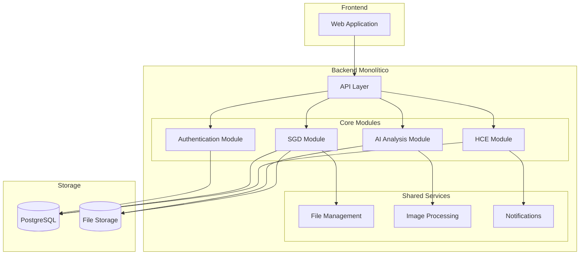
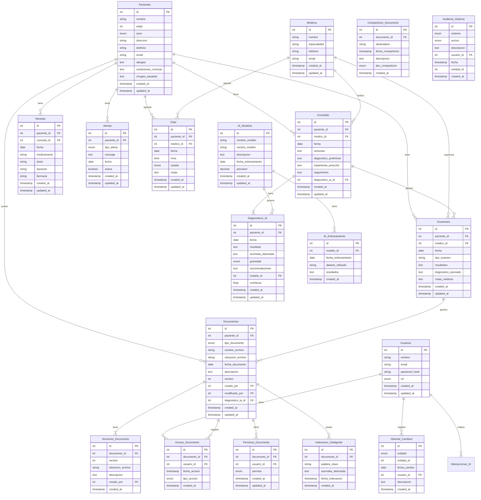

# Medical AI System

## 📋 Descripción
Sistema médico integral que combina gestión de historiales clínicos con análisis automatizado de imágenes médicas mediante IA. Diseñado para facilitar la administración de pacientes, consultas, exámenes y diagnósticos asistidos por inteligencia artificial.

## 🚀 Características Principales
- Gestión de usuarios con roles (Admin, Doctor, Enfermero)
- Administración de pacientes y historiales clínicos
- Gestión de consultas médicas
- Control de exámenes médicos
- Sistema de documentación médica
- Análisis de imágenes mediante IA
- API RESTful con autenticación JWT

## 🛠 Tecnologías
- **Backend**: Node.js, Express.js
- **Base de Datos**: PostgreSQL
- **ORM**: Sequelize
- **Autenticación**: JWT
- **Validación**: Express-validator
- **Manejo de Archivos**: Express-fileupload
- **Servicios Externos**: Axios

## 📋 Prerrequisitos
- Node.js (v20 o superior)
- PostgreSQL (v17 o superior)
- npm o yarn

## 🔧 Instalación y Configuración

1. **Clonar el repositorio**
```bash
git clone https://github.com/runinbk/medical-ai-system.git #url-del-repositorio
cd medical-ai-system
```

2. **Instalar dependencias**
```bash
npm install
```

3. **Configurar variables de entorno**
```bash
cp example.env .env
```
Editar `.env` con tus configuraciones:
```env
# Server Configuration
PORT=3000
NODE_ENV=development

# Database Configuration
DB_HOST=localhost
DB_PORT=5432
DB_NAME=medical_ai_db
DB_USER=postgres
DB_PASSWORD=your_password

# JWT Configuration
JWT_SECRET=your_secret_key
JWT_EXPIRES_IN=24h

# File Upload Configuration
UPLOAD_PATH=./uploads
MAX_FILE_SIZE=10485760
```

4. **Crear la base de datos**
```bash
createdb medical_ai_db
```
O usar pgAdmin para crear la base de datos.

5. **Ejecutar migraciones**
```bash
npx sequelize-cli db:migrate
```

6. **Ejecutar seeders (datos iniciales)**
```bash
npx sequelize-cli db:seed:all
```

7. **Iniciar el servidor**
```bash
# Modo desarrollo
npm run dev

# Modo producción
npm start
```

## 📁 Estructura del Proyecto
```
medical-system/
├── src/
│   ├── config/         # Configuraciones
│   ├── controllers/    # Controladores
│   ├── database/       # Migraciones y seeders
│   ├── middlewares/    # Middlewares
│   ├── models/         # Modelos Sequelize
│   ├── routes/         # Rutas API
│   ├── services/       # Servicios
│   └── utils/          # Utilidades
├── uploads/            # Archivos subidos
└── tests/             # Tests
```

## 🔑 Usuarios por Defecto
```json
{
    "admin": {
        "email": "admin@medical.com",
        "password": "admin123"
    },
    "doctor": {
        "email": "doctor@medical.com",
        "password": "doctor123"
    }
}
```

## 📚 Módulos Principales

### 1. Autenticación y Usuarios
- Registro y login
- Gestión de roles
- Tokens JWT
- Middleware de autenticación

### 2. Pacientes
- Gestión de información personal
- Historial médico
- Seguimiento de consultas

### 3. Médicos
- Perfiles profesionales
- Especialidades
- Gestión de consultas

### 4. Consultas
- Agendamiento
- Seguimiento
- Historiales

### 5. Exámenes
- Registro de exámenes
- Resultados
- Seguimiento

### 6. Documentos
- Gestión documental
- Almacenamiento seguro
- Control de acceso

### 7. Diagnósticos IA
- Análisis de imágenes
- Interpretación automática
- Validación médica

## 🔒 Seguridad
- Autenticación JWT
- Encriptación de contraseñas
- Validación de roles
- Control de acceso por rutas
- Rate limiting
- Protección contra ataques comunes

## 🚀 Uso del API
La documentación detallada de la API está disponible en:
[Link a la documentación de la API o Postman Collection]

## 👥 Roles y Permisos
- **ADMIN**: Acceso total al sistema
- **DOCTOR**: Gestión de pacientes, consultas y diagnósticos
- **ENFERMERO**: Acceso de lectura y actualizaciones limitadas

## 📝 Scripts Disponibles
```bash
# Desarrollo
npm run dev

# Producción
npm start

# Migraciones
npm run migrate
npm run migrate:undo

# Seeders
npm run seed
npm run seed:undo

# Tests
npm test
```

## 💻 Arquitectura



## 💽 Base de Datos



## 🤝 Contribución
1. Fork el proyecto
2. Crear feature branch (`git checkout -b feature/AmazingFeature`)
3. Commit cambios (`git commit -m 'Add AmazingFeature'`)
4. Push al branch (`git push origin feature/AmazingFeature`)
5. Abrir Pull Request

## 📄 Licencia
Este proyecto está bajo la Licencia MIT - ver el archivo [LICENSE.md](LICENSE.md) para detalles.

## ✍️ Autor

- **Kevin B. Gomoez R.** - *Software Developer* - [runinbk💻🔥](https://github.com/runinbk)

## 🎁 Agradecimientos

- Al esplendido equipo con el que trabajo ❤