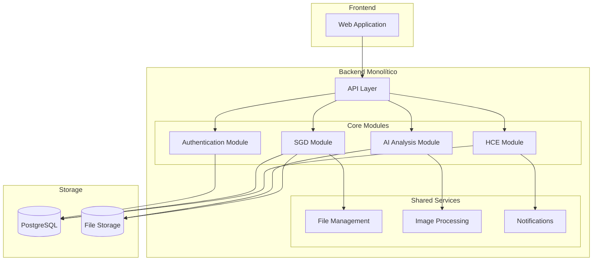

# medical-ai-system


## 📝 Estructura del proyecto

```
medical-ai-system/
├── src/
│   ├── config/
│   │   ├── database.js
│   │   ├── storage.js
│   │   └── auth.js
│   ├── modules/
│   │   ├── auth/
│   │   ├── hce/
│   │   ├── sgd/
│   │   └── ai/
│   ├── shared/
│   │   ├── middlewares/
│   │   ├── utils/
│   │   └── services/
│   ├── routes/
│   └── app.js
├── docs/
└── tests/
```

## 💻 Arquitectura



## 💽 Base de Datos


