# Arbol completo de todas las rutas del sistema

```mermaid
flowchart TD
    API["/api"] --> Auth["/auth"]
    API --> Pacientes["/pacientes"]
    API --> Medicos["/medicos"]
    API --> Consultas["/consultas"]
    API --> Examenes["/examenes"]
    API --> Docs["/documentos"]
    API --> DiagIA["/diagnosticos-ia"]

    %% Rutas de Autenticación
    Auth --> |"POST"| AuthReg["/registro"]
    Auth --> |"POST"| AuthLog["/login"]
    Auth --> |"GET"| AuthPro["/perfil"]

    %% Rutas de Pacientes
    Pacientes --> |"POST"| PacCreate["/"]
    Pacientes --> |"GET"| PacGetAll["/"]
    Pacientes --> |"GET"| PacGetOne["/:id"]
    Pacientes --> |"PUT"| PacUpdate["/:id"]
    Pacientes --> |"DELETE"| PacDelete["/:id"]

    %% Rutas de Médicos
    Medicos --> |"POST"| MedCreate["/"]
    Medicos --> |"GET"| MedGetAll["/"]
    Medicos --> |"GET"| MedGetOne["/:id"]
    Medicos --> |"PUT"| MedUpdate["/:id"]
    Medicos --> |"DELETE"| MedDelete["/:id"]
    Medicos --> |"GET"| MedEsp["/especialidad/:especialidad"]

    %% Rutas de Consultas
    Consultas --> |"POST"| ConCreate["/"]
    Consultas --> |"GET"| ConGetAll["/"]
    Consultas --> |"GET"| ConGetOne["/:id"]
    Consultas --> |"PUT"| ConUpdate["/:id"]
    Consultas --> |"DELETE"| ConDelete["/:id"]
    Consultas --> |"GET"| ConMed["/medico/:medico_id"]
    Consultas --> |"GET"| ConPac["/paciente/:paciente_id"]

    %% Rutas de Exámenes
    Examenes --> |"POST"| ExaCreate["/"]
    Examenes --> |"GET"| ExaGetAll["/"]
    Examenes --> |"GET"| ExaGetOne["/:id"]
    Examenes --> |"PUT"| ExaUpdate["/:id"]
    Examenes --> |"DELETE"| ExaDelete["/:id"]
    Examenes --> |"GET"| ExaPac["/paciente/:paciente_id"]

    %% Rutas de Documentos
    Docs --> |"POST"| DocCreate["/"]
    Docs --> |"GET"| DocGetAll["/"]
    Docs --> |"GET"| DocGetOne["/:id"]
    Docs --> |"GET"| DocDown["/:id/descargar"]
    Docs --> |"PUT"| DocUpdate["/:id"]
    Docs --> |"DELETE"| DocDelete["/:id"]
    Docs --> |"GET"| DocPac["/paciente/:paciente_id"]

    %% Rutas de Diagnósticos IA
    DiagIA --> |"POST"| DiaAnalyze["/analizar"]
    DiagIA --> |"GET"| DiaGetAll["/"]
    DiagIA --> |"GET"| DiaGetOne["/:id"]
    DiagIA --> |"PUT"| DiaValidate["/:id/validar"]
    DiagIA --> |"GET"| DiaPac["/paciente/:paciente_id"]

    %% Subgraph para Permisos por Rol
    subgraph Roles
        Admin["ADMIN - Acceso Total"]
        Doctor["DOCTOR - Crear y Gestionar"]
        Enfermero["ENFERMERO - Solo Lectura"]
    end

    %% Subgraph para Validaciones
    subgraph Validaciones
        JWT["Validación JWT"]
        Roles["Validación Roles"]
        Fields["Validación Campos"]
    end

    style API fill:#f9f,stroke:#333,stroke-width:2px
    style Auth fill:#bbf,stroke:#333,stroke-width:2px
    style Pacientes fill:#bfb,stroke:#333,stroke-width:2px
    style Medicos fill:#bfb,stroke:#333,stroke-width:2px
    style Consultas fill:#fbf,stroke:#333,stroke-width:2px
    style Examenes fill:#fbf,stroke:#333,stroke-width:2px
    style Docs fill:#fbb,stroke:#333,stroke-width:2px
    style DiagIA fill:#bff,stroke:#333,stroke-width:2px

    classDef post fill:#ff9999,stroke:#333
    classDef get fill:#99ff99,stroke:#333
    classDef put fill:#9999ff,stroke:#333
    classDef delete fill:#ffff99,stroke:#333

    class AuthReg,PacCreate,MedCreate,ConCreate,ExaCreate,DocCreate,DiaAnalyze post
    class AuthLog post
    class AuthPro,PacGetAll,PacGetOne,MedGetAll,MedGetOne,ConGetAll,ConGetOne,ExaGetAll,ExaGetOne,DocGetAll,DocGetOne,DiaGetAll,DiaGetOne get
    class PacUpdate,MedUpdate,ConUpdate,ExaUpdate,DocUpdate,DiaValidate put
    class PacDelete,MedDelete,ConDelete,ExaDelete,DocDelete delete

```

Características del árbol de rutas:
1. Organización por módulos
2. Métodos HTTP diferenciados por colores
3. Permisos por rol
4. Validaciones requeridas

Resumen de endpoints por módulo:

1. **Autenticación** (/api/auth):
   - POST /registro
   - POST /login
   - GET /perfil

2. **Pacientes** (/api/pacientes):
   - CRUD básico
   - GET /id
   - GET / (listado)

3. **Médicos** (/api/medicos):
   - CRUD básico
   - Filtro por especialidad
   - GET /especialidad/:especialidad

4. **Consultas** (/api/consultas):
   - CRUD básico
   - Filtros por médico y paciente
   - GET /medico/:medico_id
   - GET /paciente/:paciente_id

5. **Exámenes** (/api/examenes):
   - CRUD básico
   - Filtro por paciente
   - GET /paciente/:paciente_id

6. **Documentos** (/api/documentos):
   - CRUD básico
   - Descarga de documentos
   - GET /:id/descargar
   - Filtro por paciente

7. **Diagnósticos IA** (/api/diagnosticos-ia):
   - Análisis de imágenes
   - Validación de resultados
   - Filtro por paciente
   - POST /analizar
   - PUT /:id/validar

¿Necesitas más detalles sobre algún módulo o ruta específica?