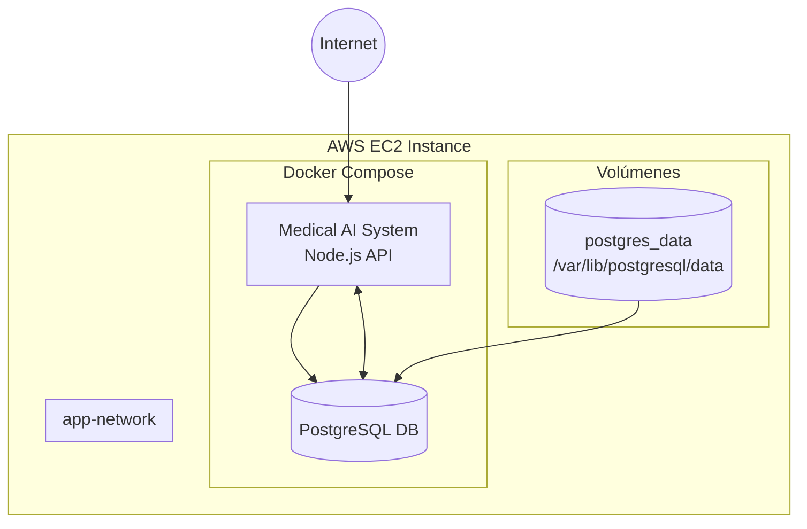

# Manual de Despliegue - Medical AI System en AWS

## 1. Crear una instancia EC2:
   - Ve a EC2 en la consola de AWS
   - Haz clic en "Create instance"
   - Selecciona Ubuntu Server 22.04 LTS
   - Para la aplicación médica, recomiendo una t2.small (2 GB RAM) como mínimo
   - Crea o selecciona un key pair para SSH

2. Configuración de seguridad (Security Group):

    En "Inbound security group rules", añade:

    1. Para SSH (por defecto):
        - Type: SSH
        - Protocol: TCP
        - Port: 22
        - Source: Anywhere (0.0.0.0/0)
        - Description: SSH access

    2. Para HTTP:
        - Type: HTTP
        - Protocol: TCP
        - Port: 80
        - Source: Anywhere (0.0.0.0/0)
        - Description: HTTP access

    3. Para HTTPS:
        - Type: HTTPS
        - Protocol: TCP
        - Port: 443
        - Source: Anywhere (0.0.0.0/0)
        - Description: HTTPS access

    4. Para la API:
        - Type: Custom TCP
        - Protocol: TCP
        - Port: 3000
        - Source: Anywhere (0.0.0.0/0)
        - Description: API access

## 2. Conectarse al servidor desde Windows 10

1. Descargar e instalar PuTTY:
   - Ve a https://www.putty.org/
   - Descarga e instala la última versión

2. Convertir la clave .pem a .ppk:
   - Abre PuTTYgen
   - Click en "Load"
   - Selecciona "All Files (*.*)"
   - Busca y selecciona tu archivo .pem
   - Click en "Save private key"
   - Guarda el archivo .ppk

3. Conectarse usando PuTTY:
   - Host Name: ubuntu@tu-ip-publica
   - En Connection > SSH > Auth > Credentials
   - Selecciona tu archivo .ppk
   - Guarda la sesión para uso futuro
   - Click en "Open"

## 3. Preparar el entorno en el servidor

1. Actualizar el sistema:
```bash
sudo apt-get update
sudo apt-get upgrade -y
```

2. Instalar Docker:
```bash
curl -fsSL https://get.docker.com -o get-docker.sh
sudo sh get-docker.sh
```

3. Añadir usuario al grupo docker:
```bash
sudo usermod -aG docker $USER
exec sudo su -l $USER
```

4. Instalar Docker Compose:
```bash
sudo apt-get install docker-compose -y
```

## 4. Preparar y subir la imagen Docker

1. En tu máquina local, construir la imagen:
```bash
docker build -t tuusuario/medical-ai-system:latest .
```

2. Subir la imagen a Docker Hub:
```bash
# Login en Docker Hub
docker login

# Subir imagen
docker push tuusuario/medical-ai-system:latest
```

## 5. Desplegar la aplicación

1. En el servidor, crear el directorio del proyecto:
```bash
mkdir ~/medical-ai-system
cd ~/medical-ai-system
```

2. Crear el archivo docker-compose.yml:
```bash
nano docker-compose.yml
```

Contenido:
```yaml
version: '3.8'

services:
  app:
    image: tuusuario/medical-ai-system:latest
    ports:
      - "3000:3000"
    environment:
      - NODE_ENV=production
      - DB_HOST=db
      - DB_PORT=5432
      - DB_USER=${DB_USER}
      - DB_PASSWORD=${DB_PASSWORD}
      - DB_NAME=${DB_NAME}
      - JWT_SECRET=${JWT_SECRET}
      - JWT_REFRESH_SECRET=${JWT_REFRESH_SECRET}
    networks:
      - app-network
    depends_on:
      - db
    restart: always

  db:
    image: postgres:14-alpine
    environment:
      - POSTGRES_USER=${DB_USER}
      - POSTGRES_PASSWORD=${DB_PASSWORD}
      - POSTGRES_DB=${DB_NAME}
    volumes:
      - postgres_data:/var/lib/postgresql/data
    networks:
      - app-network
    restart: always

networks:
  app-network:
    driver: bridge

volumes:
  postgres_data:
```

3. Crear archivo .env:
```bash
nano .env
```

Contenido:
```env
NODE_ENV=production
DB_HOST=db
DB_PORT=5432
DB_USER=postgres
DB_PASSWORD=tu_contraseña_segura
DB_NAME=medical_ai_db
JWT_SECRET=tu_jwt_secret_seguro
JWT_REFRESH_SECRET=tu_jwt_refresh_seguro
```

4. Iniciar los servicios:
```bash
docker-compose up -d
```

5. Ejecutar migraciones y seeders:
```bash
docker-compose exec app npm run migrate:run
docker-compose exec app npm run seed:run
```

## 6. Mantenimiento y actualizaciones

1. Ver logs:
```bash
# Ver todos los logs
docker-compose logs -f

# Ver logs específicos
docker-compose logs app
docker-compose logs db
```

2. Actualizar la aplicación:

En tu máquina local:
```bash
# Construir nueva versión
docker build -t tuusuario/medical-ai-system:latest .

# Subir a Docker Hub
docker push tuusuario/medical-ai-system:latest
```

En el servidor:
```bash
# Actualizar imagen
docker-compose pull

# Reiniciar servicios
docker-compose down
docker-compose up -d
```

3. Backup de la base de datos:
```bash
docker-compose exec db pg_dump -U postgres medical_ai_db > backup.sql
```

4. Restaurar backup:
```bash
cat backup.sql | docker-compose exec -T db psql -U postgres -d medical_ai_db
```

# Diagramas

