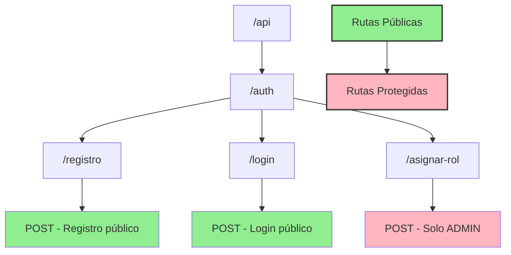

# Rutas - Guía de Pruebas en Postman

## Árbol de Rutas



## Registro de Usuario
```http
POST http://localhost:3000/api/auth/registro
Content-Type: application/json

{
    "nombre": "Usuario Test",
    "email": "test@example.com",
    "password": "123456"
}
```
**Respuesta Exitosa**: Status 201
```json
{
    "msg": "Usuario registrado exitosamente",
    "token": "jwt-token",
    "usuario": {
        "id": 1,
        "nombre": "Usuario Test",
        "email": "test@example.com",
        "roles": ["DEFAULT_USER"]
    }
}
```

## Login
```http
POST http://localhost:3000/api/auth/login
Content-Type: application/json

{
    "email": "test@example.com",
    "password": "123456"
}
```
**Respuesta Exitosa**: Status 200
```json
{
    "msg": "Login exitoso",
    "token": "jwt-token",
    "usuario": {
        "id": 1,
        "nombre": "Usuario Test",
        "email": "test@example.com",
        "roles": ["DEFAULT_USER"]
    }
}
```

## Asignar Rol (Requiere token de ADMIN)
```http
POST http://localhost:3000/api/auth/asignar-rol
Content-Type: application/json
x-token: [token-admin]

{
    "usuarioId": 1,
    "rolNombre": "DOCTOR"
}
```
**Respuesta Exitosa**: Status 200
```json
{
    "msg": "Rol asignado correctamente",
    "usuario": {
        "id": 1,
        "nombre": "Usuario Test",
        "email": "test@example.com",
        "roles": ["DEFAULT_USER", "DOCTOR"]
    }
}
```

## Renovar Token
```http
GET http://localhost:3000/api/auth/renew
x-token: jwt-token-actual
```

**Respuesta Exitosa**: Status 200
```json
{
    "ok": true,
    "token": "nuevo-jwt-token",
    "usuario": {
        "id": 1,
        "nombre": "Usuario Test",
        "email": "test@example.com",
        "roles": ["DEFAULT_USER"]
    }
}
```

**Respuesta Error**: Status 401
```json
{
    "msg": "No hay token en la petición"
}
```

**Respuesta Error**: Status 500
```json
{
    "msg": "Error en el servidor"
}
```

## Notas Importantes
1. Guardar el token JWT recibido en las respuestas
2. Incluir el token en el header `x-token` para rutas protegidas
3. Solo usuarios ADMIN pueden asignar roles
4. Los tokens expiran en 4 horas