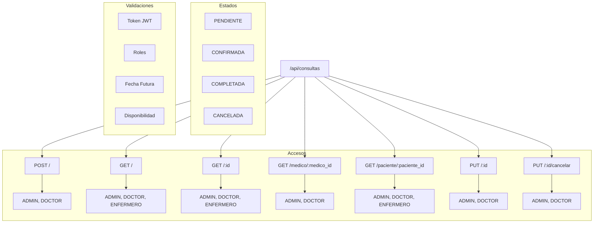

# Guía de Pruebas en Postman - Módulo Consultas

## Árbol de Rutas



## Prerequisitos
- Token JWT válido (requiere login previo)
- Rol adecuado (ADMIN o DOCTOR para operaciones de escritura)
- IDs válidos de pacientes y médicos

## Endpoints

### 1. Crear Consulta
```json
POST http://localhost:3000/api/consultas
Headers:
  Content-Type: application/json
  x-token: [jwt-token]

Body:
{
    "paciente_id": 1,
    "medico_id": 1,
    "fecha": "2024-12-01T10:00:00",
    "sintomas": "Dolor de cabeza y mareos",
    "notas": "Primera consulta del paciente"
}
```
**Respuesta Exitosa**: Status 201
```json
{
    "msg": "Consulta agendada exitosamente",
    "consulta": {
        "id": 1,
        "paciente_id": 1,
        "medico_id": 1,
        ...
    }
}
```

### 2. Obtener Consultas
```json
GET http://localhost:3000/api/consultas
Headers:
  x-token: [jwt-token]
```

### 3. Obtener por Médico
```json
GET http://localhost:3000/api/consultas/medico/1
Headers:
  x-token: [jwt-token]
```

### 4. Obtener por Paciente
```json
GET http://localhost:3000/api/consultas/paciente/1
Headers:
  x-token: [jwt-token]
```

### 5. Actualizar Consulta
```json
PUT http://localhost:3000/api/consultas/1
Headers:
  Content-Type: application/json
  x-token: [jwt-token]

Body:
{
    "estado": "CONFIRMADA",
    "notas": "Consulta confirmada"
}
```

### 6. Cancelar Consulta
```json
PUT http://localhost:3000/api/consultas/1/cancelar
Headers:
  x-token: [jwt-token]
```

## Códigos de Estado
- 201: Creación exitosa
- 200: Operación exitosa
- 400: Error de validación
- 401: No autorizado
- 403: Prohibido (rol inadecuado)
- 404: Consulta no encontrada
- 500: Error del servidor