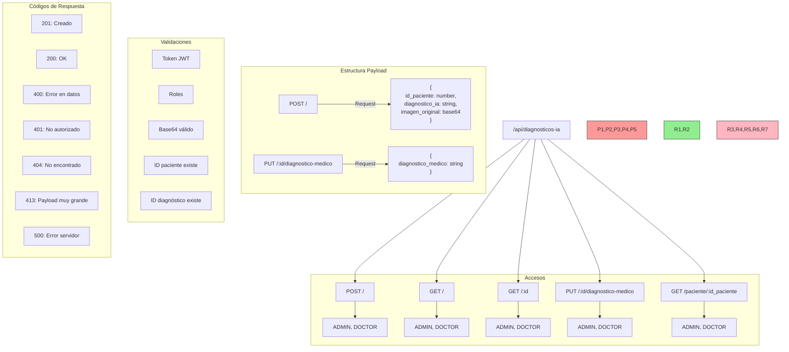

# Guía de Pruebas para Diagnósticos IA en Postman

## Árbol de Rutas



## 1. Configuración Inicial

### 1.1 Crear una nueva colección
1. Abrir Postman
2. Crear nueva colección llamada "Diagnósticos IA"
3. En la colección, ir a Variables y agregar:
   - `base_url`: `http://localhost:3000/api`
   - `token`: [dejar vacío por ahora]

### 1.2 Configurar autenticación
1. Obtener token JWT usando la ruta de login
```http
POST {{base_url}}/auth/login
Content-Type: application/json

{
    "email": "doctor@ejemplo.com",
    "password": "password123"
}
```
2. Guardar el token retornado en la variable de colección `token`

## 2. Crear Requests

### 2.1 Crear Diagnóstico
```http
POST {{base_url}}/diagnosticos-ia
Headers:
  x-token: {{token}}
  Content-Type: application/json

{
    "id_paciente": 1,
    "diagnostico_ia": "Análisis preliminar muestra posible anomalía en región superior derecha",
    "imagen_original": "data:image/jpeg;base64,/9j/4AAQSkZJRg..." // aquí va tu imagen en base64
}
```

### 2.2 Obtener Todos los Diagnósticos
```http
GET {{base_url}}/diagnosticos-ia
Headers:
  x-token: {{token}}
```

### 2.3 Obtener Diagnóstico por ID
```http
GET {{base_url}}/diagnosticos-ia/1
Headers:
  x-token: {{token}}
```

### 2.4 Actualizar Diagnóstico Médico
```http
PUT {{base_url}}/diagnosticos-ia/1/diagnostico-medico
Headers:
  x-token: {{token}}
Content-Type: application/json

{
    "diagnostico_medico": "Se confirma hallazgo en región superior derecha. Se recomienda seguimiento."
}
```

### 2.5 Obtener Diagnósticos por Paciente
```http
GET {{base_url}}/diagnosticos-ia/paciente/1
Headers:
  x-token: {{token}}
```

## 3. Pruebas Paso a Paso

### 3.1 Preparar imagen de prueba
1. Obtener una imagen médica de prueba
2. Convertirla a base64:
   - En Windows: usar alguna herramienta online de conversión a base64
   - En Linux/Mac: usar el comando:
   ```bash
   base64 imagen.jpg | tr -d '\n' | pbcopy
   ```

### 3.2 Flujo de prueba completo

1. **Autenticación**
   - Ejecutar request de login
   - Verificar que se recibe el token
   - El token se guardará automáticamente en la variable de colección

2. **Crear diagnóstico**
   - Usar la ruta POST con la imagen en base64
   - Verificar respuesta 201
   - Guardar el ID del diagnóstico creado

3. **Consultar diagnóstico**
   - Usar la ruta GET con el ID guardado
   - Verificar que los datos coinciden
   - Verificar que las imágenes se devuelven en base64

4. **Actualizar diagnóstico médico**
   - Usar la ruta PUT para añadir diagnóstico médico
   - Verificar respuesta 200
   - Consultar nuevamente para verificar actualización

5. **Listar diagnósticos del paciente**
   - Usar la ruta GET de paciente
   - Verificar que aparece el diagnóstico creado

## 4. Tests Automáticos

Puedes añadir estos tests en la pestaña "Tests" de cada request:

```javascript
// Para crear diagnóstico
pm.test("Diagnóstico creado correctamente", function () {
    pm.response.to.have.status(201);
    pm.expect(pm.response.json()).to.have.property('diagnostico');
    pm.collectionVariables.set('ultimo_diagnostico_id', pm.response.json().diagnostico.id);
});

// Para obtener diagnóstico
pm.test("Diagnóstico obtenido correctamente", function () {
    pm.response.to.have.status(200);
    const diagnostico = pm.response.json();
    pm.expect(diagnostico).to.have.property('imagen_original');
    pm.expect(diagnostico).to.have.property('imagen_marcada_ia');
});
```

## 5. Variables de Entorno Recomendadas

Crear un ambiente "Development" con:
- `base_url`: http://localhost:3000/api
- `token`: [vacío]
- `ultimo_diagnostico_id`: [vacío]

## 6. Manejo de Errores

Verificar respuestas de error:
- 400: Datos inválidos
- 401: Token no válido
- 403: No autorizado para la acción
- 404: Recurso no encontrado
- 413: Archivo demasiado grande
- 500: Error del servidor