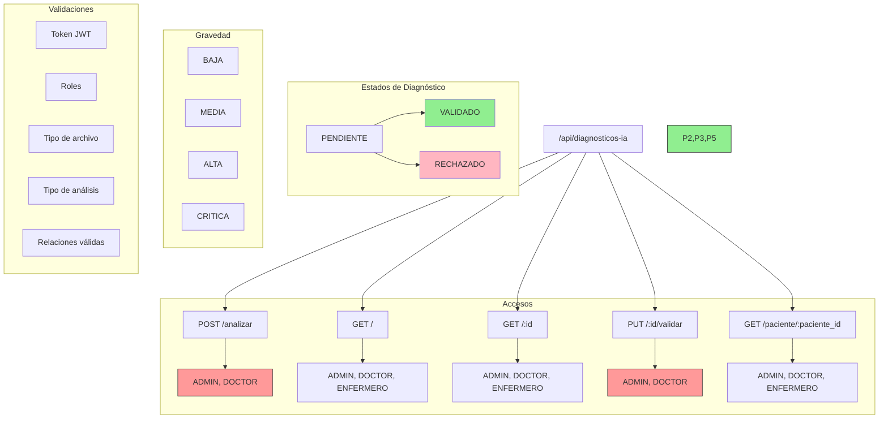

# Guía de Pruebas en Postman - Módulo Diagnósticos IA

## Árbol de Rutas



## Prerequisitos
- Token JWT válido (rol DOCTOR o ADMIN)
- IDs válidos de pacientes y exámenes
- Imágenes médicas para pruebas

## Endpoints

### 1. Realizar Análisis
```http
POST http://localhost:3000/api/diagnosticos-ia/analizar
Headers:
  x-token: [jwt-token]
Content-Type: multipart/form-data

Form Data:
- imagen: [archivo de imagen]
- paciente_id: 1
- examen_id: 1 (opcional)
- tipo_analisis: "RADIOGRAFIA"
```
**Respuesta Exitosa**: Status 201
```json
{
    "msg": "Análisis completado exitosamente",
    "diagnostico": {
        "id": 1,
        "anomalia_detectada": "posible neumonía",
        "gravedad": "ALTA",
        "confianza": 0.85,
        ...
    }
}
```

### 2. Obtener Diagnósticos
```http
GET http://localhost:3000/api/diagnosticos-ia
Headers:
  x-token: [jwt-token]
```

### 3. Obtener Diagnóstico por ID
```http
GET http://localhost:3000/api/diagnosticos-ia/1
Headers:
  x-token: [jwt-token]
```

### 4. Validar Diagnóstico
```http
PUT http://localhost:3000/api/diagnosticos-ia/1/validar
Headers:
  x-token: [jwt-token]
Content-Type: application/json

{
    "estado": "VALIDADO",
    "comentarios_medico": "Diagnóstico preciso, iniciar tratamiento"
}
```

### 5. Obtener Diagnósticos por Paciente
```http
GET http://localhost:3000/api/diagnosticos-ia/paciente/1
Headers:
  x-token: [jwt-token]
```

## Códigos de Estado
- 201: Creación exitosa
- 200: Operación exitosa
- 400: Error en datos proporcionados
- 401: No autorizado
- 403: Prohibido
- 404: No encontrado
- 500: Error del servidor