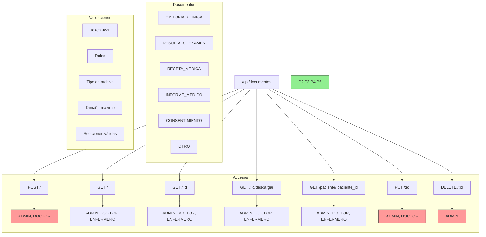

# Guía de Pruebas en Postman - Módulo Documentos

## Árbol de Rutas



## Prerequisitos
- Token JWT válido
- Rol adecuado
- IDs válidos de pacientes, consultas o exámenes
- Archivos para pruebas

## Endpoints

### 1. Crear Documento
```http
POST http://localhost:3000/api/documentos
Headers:
  x-token: [jwt-token]
Content-Type: multipart/form-data

Form Data:
- archivo: [file]
- paciente_id: 1
- consulta_id: 1 (opcional)
- examen_id: 1 (opcional)
- tipo_documento: RESULTADO_EXAMEN
- descripcion: "Descripción del documento"
```

### 2. Obtener Documentos
```http
GET http://localhost:3000/api/documentos
Headers:
  x-token: [jwt-token]
```

### 3. Descargar Documento
```http
GET http://localhost:3000/api/documentos/1/descargar
Headers:
  x-token: [jwt-token]
```

### 4. Actualizar Documento
```http
PUT http://localhost:3000/api/documentos/1
Headers:
  x-token: [jwt-token]
Content-Type: multipart/form-data

Form Data:
- archivo: [file] (opcional)
- descripcion: "Nueva descripción"
```

## Respuestas del API

### Éxito
```json
{
    "msg": "Documento creado exitosamente",
    "documento": {
        "id": 1,
        "nombre_archivo": "ejemplo.pdf",
        "tipo_documento": "RESULTADO_EXAMEN",
        ...
    }
}
```

### Error
```json
{
    "msg": "Error específico del problema"
}
```

## Códigos de Estado
- 201: Creación exitosa
- 200: Operación exitosa
- 400: Error de validación
- 401: No autorizado
- 403: Prohibido
- 404: No encontrado
- 500: Error del servidor