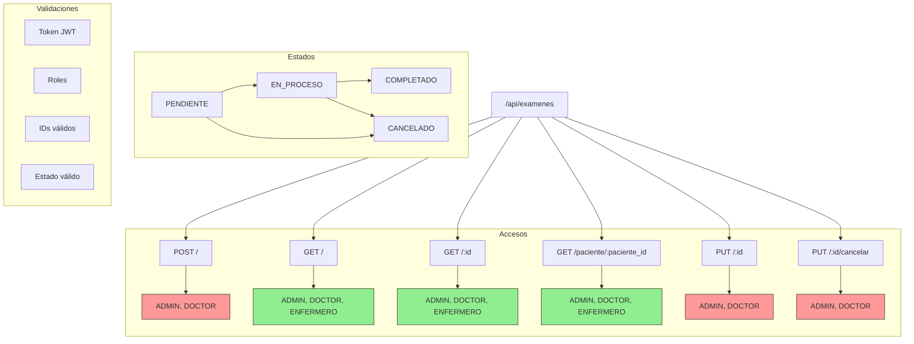

# Guía de Pruebas en Postman - Módulo Exámenes

## Árbol de Rutas



## Prerequisitos
- Token JWT válido (requiere login previo)
- Rol adecuado (ADMIN o DOCTOR para operaciones de escritura)
- IDs válidos de pacientes y médicos

## Endpoints

### 1. Crear Examen
```http
POST http://localhost:3000/api/examenes
Headers:
  Content-Type: application/json
  x-token: [jwt-token]

Body:
{
    "paciente_id": 1,
    "medico_id": 1,
    "consulta_id": 1,
    "tipo_examen": "Radiografía de Tórax",
    "notas_medicas": "Paciente presenta molestias respiratorias"
}
```
**Respuesta Exitosa**: Status 201
```json
{
    "msg": "Examen creado exitosamente",
    "examen": {
        "id": 1,
        "paciente_id": 1,
        "medico_id": 1,
        ...
    }
}
```

### 2. Obtener Todos los Exámenes
```http
GET http://localhost:3000/api/examenes
Headers:
  x-token: [jwt-token]
```

### 3. Obtener Examen por ID
```http
GET http://localhost:3000/api/examenes/1
Headers:
  x-token: [jwt-token]
```

### 4. Obtener por Paciente
```http
GET http://localhost:3000/api/examenes/paciente/1
Headers:
  x-token: [jwt-token]
```

### 5. Actualizar Examen
```http
PUT http://localhost:3000/api/examenes/1
Headers:
  Content-Type: application/json
  x-token: [jwt-token]

Body:
{
    "estado": "EN_PROCESO",
    "resultados": "Se observa inflamación",
    "diagnostico_asociado": "Bronquitis aguda"
}
```

### 6. Cancelar Examen
```http
PUT http://localhost:3000/api/examenes/1/cancelar
Headers:
  x-token: [jwt-token]
```

## Códigos de Estado
- 201: Creación exitosa
- 200: Operación exitosa
- 400: Error de validación
- 401: No autorizado
- 403: Prohibido (rol inadecuado)
- 404: Examen no encontrado
- 500: Error del servidor