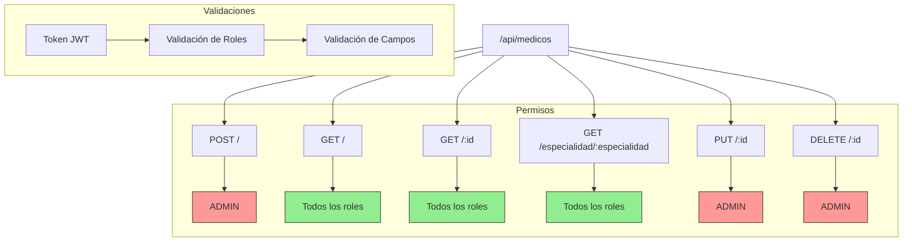

# Guía de Pruebas en Postman - Módulo Médicos

## Árbol de Rutas



## Prerequisitos
- Token JWT válido (requiere login previo)
- Rol adecuado (ADMIN para operaciones de escritura)

## Endpoints

### 1. Crear Médico
```http
POST http://localhost:3000/api/medicos
Headers:
  Content-Type: application/json
  x-token: [jwt-token]

Body:
{
    "nombre": "Dr. Juan Pérez",
    "especialidad": "Cardiología",
    "telefono": "123-456-7890",
    "email": "dr.perez@hospital.com"
}
```
**Respuesta Exitosa**: Status 201
```json
{
    "msg": "Médico creado exitosamente",
    "medico": {
        "id": 1,
        "nombre": "Dr. Juan Pérez",
        ...
    }
}
```

### 2. Obtener Médicos
```http
GET http://localhost:3000/api/medicos
Headers:
  x-token: [jwt-token]
```

### 3. Obtener por Especialidad
```http
GET http://localhost:3000/api/medicos/especialidad/Cardiología
Headers:
  x-token: [jwt-token]
```

### 4. Actualizar Médico
```http
PUT http://localhost:3000/api/medicos/1
Headers:
  Content-Type: application/json
  x-token: [jwt-token]

Body:
{
    "nombre": "Dr. Juan Pablo Pérez",
    "telefono": "123-456-7899"
}
```

### 5. Eliminar Médico
```http
DELETE http://localhost:3000/api/medicos/1
Headers:
  x-token: [jwt-token]
```

## Códigos de Estado
- 200: Operación exitosa
- 201: Creación exitosa
- 400: Error en los datos enviados
- 401: No autorizado
- 403: Prohibido (rol inadecuado)
- 404: Médico no encontrado
- 500: Error del servidor