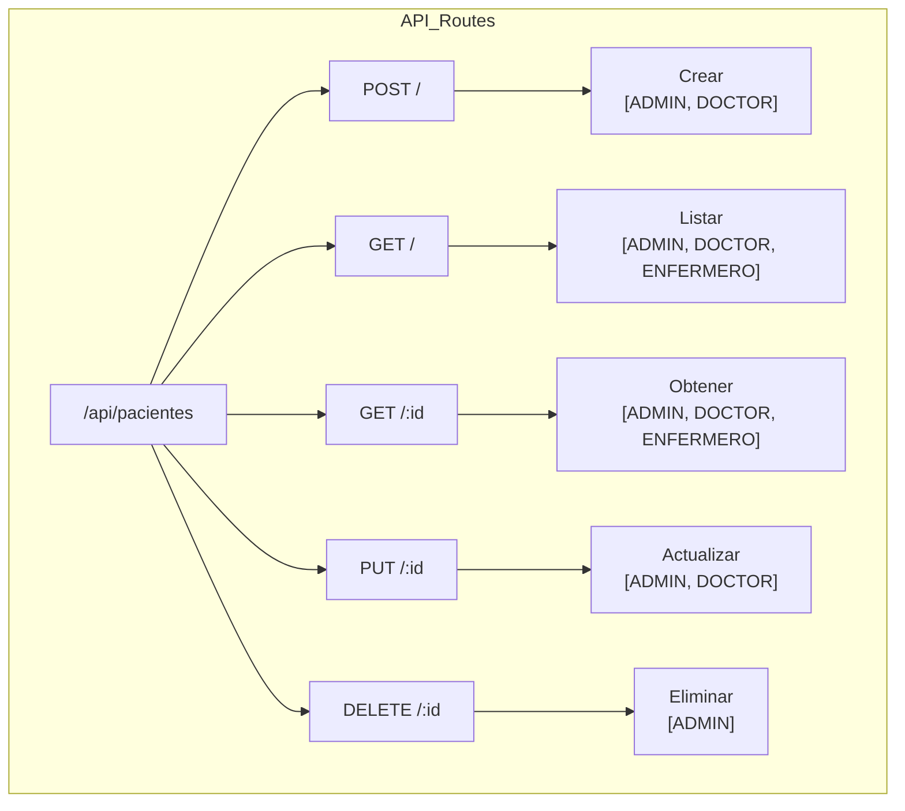

# Módulo de Pacientes - Documentación Técnica

## Descripción
Módulo para la gestión completa de pacientes en el sistema médico, permitiendo el registro, consulta, actualización y eliminación de información de pacientes.

## Tecnologías Utilizadas
- **Sequelize**: ORM para manejo del modelo de pacientes
- **Express**: Routing y middleware
- **Express-validator**: Validación de datos de entrada
- **JWT**: Autenticación y autorización por roles

## Estructura de Base de Datos
### Tabla `pacientes`
- `id`: INTEGER (PK, Auto-increment)
- `nombre`: STRING (Not Null)
- `edad`: INTEGER (Not Null)
- `sexo`: ENUM ('M', 'F', 'O')
- `direccion`: STRING
- `telefono`: STRING
- `email`: STRING (Unique)
- `alergias`: TEXT
- `condiciones_cronicas`: TEXT
- `cirugias_pasadas`: TEXT
- `usuario_id`: INTEGER (FK -> usuarios.id)
- `activo`: BOOLEAN (Default: true)
- `created_at`: TIMESTAMP
- `updated_at`: TIMESTAMP

### Relaciones
- **Usuario**: Relación con la tabla `usuarios` (1:N)
- **Consultas**: Preparado para futura relación con tabla `consultas`

## Seguridad y Permisos
### Roles y Accesos
- **ADMIN**: Acceso total
- **DOCTOR**: Crear, leer, actualizar
- **ENFERMERO**: Solo lectura
- **DEFAULT_USER**: Sin acceso

### Validaciones
- Nombre obligatorio
- Edad entre 0 y 150 años
- Sexo válido (M/F/O)
- Email único y válido
- Token JWT requerido
- Verificación de roles

## Componentes del Sistema

### Modelo (paciente.js)
- Definición del modelo Sequelize
- Validaciones de datos
- Relaciones con otros modelos

### Controlador (pacientes.controller.js)
- **crear**: Nuevo paciente
- **obtenerTodos**: Lista de pacientes activos
- **obtenerPorId**: Detalles de un paciente
- **actualizar**: Modificar datos
- **eliminar**: Eliminación lógica

### Rutas (pacientes.routes.js)
- Definición de endpoints
- Middleware de validación
- Control de acceso por roles

## Manejo de Errores
- Validación de datos de entrada
- Manejo de duplicados (email)
- Respuestas de error estandarizadas
- Logging de errores

## Arbol de Rutas

