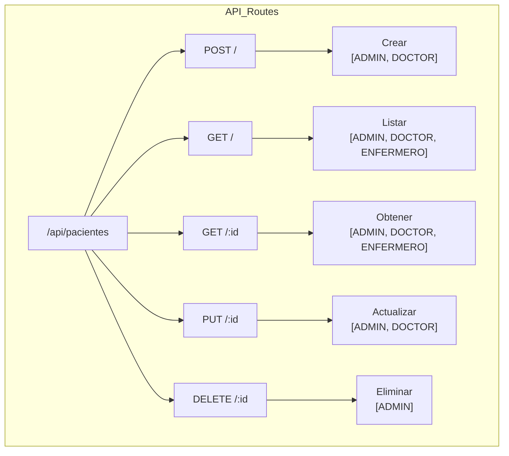

# Guía de Pruebas en Postman - Módulo Pacientes

## Árbol de Rutas



## Prerequisitos
- Token JWT válido (requiere login previo)
- Rol adecuado (ADMIN, DOCTOR o ENFERMERO)

## Endpoints

### 1. Crear Paciente
```http
POST http://localhost:3000/api/pacientes
Headers:
  Content-Type: application/json
  x-token: [jwt-token]

Body:
{
    "nombre": "Juan Pérez",
    "edad": 35,
    "sexo": "M",
    "direccion": "Av. Principal 123",
    "telefono": "123-456-7890",
    "email": "juan@example.com",
    "alergias": "Penicilina",
    "condiciones_cronicas": "Hipertensión",
    "cirugias_pasadas": "Apendicectomía 2018"
}
```
**Respuesta Exitosa**: Status 201
```json
{
    "msg": "Paciente creado exitosamente",
    "paciente": {
        "id": 1,
        "nombre": "Juan Pérez",
        ...
    }
}
```

### 2. Obtener Pacientes
```http
GET http://localhost:3000/api/pacientes
Headers:
  x-token: [jwt-token]
```
**Respuesta Exitosa**: Status 200
```json
[
    {
        "id": 1,
        "nombre": "Juan Pérez",
        ...
    }
]
```

### 3. Obtener Paciente por ID
```http
GET http://localhost:3000/api/pacientes/1
Headers:
  x-token: [jwt-token]
```

### 4. Actualizar Paciente
```http
PUT http://localhost:3000/api/pacientes/1
Headers:
  Content-Type: application/json
  x-token: [jwt-token]

Body:
{
    "nombre": "Juan Pablo Pérez",
    "telefono": "123-456-7899"
}
```

### 5. Eliminar Paciente
```http
DELETE http://localhost:3000/api/pacientes/1
Headers:
  x-token: [jwt-token]
```

## Códigos de Estado
- 200: Operación exitosa
- 201: Creación exitosa
- 400: Error en los datos enviados
- 401: No autorizado
- 403: Prohibido (rol inadecuado)
- 404: Paciente no encontrado
- 500: Error del servidor